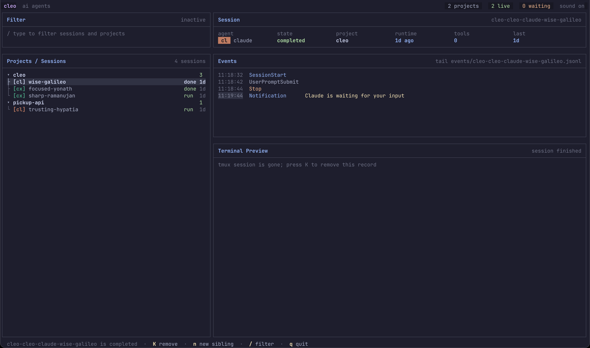
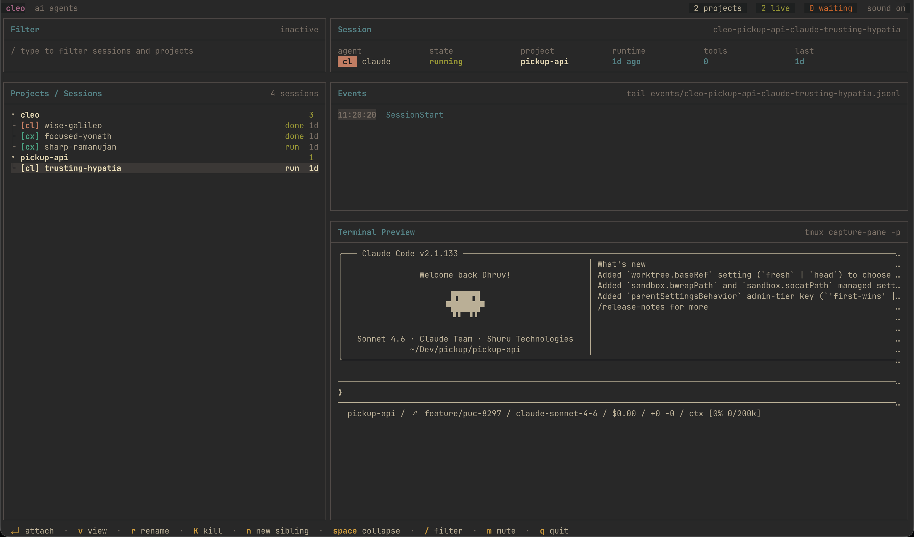
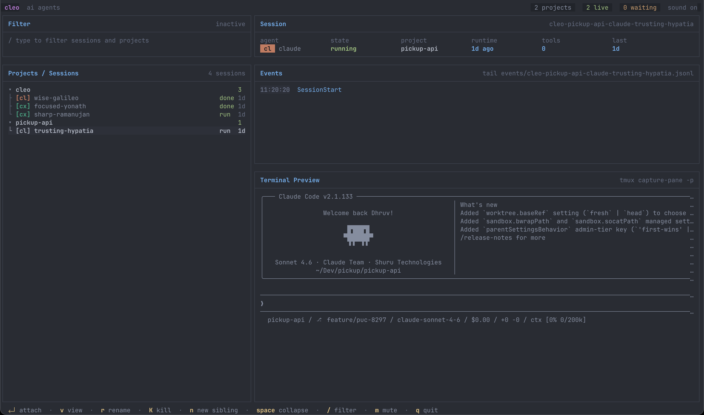
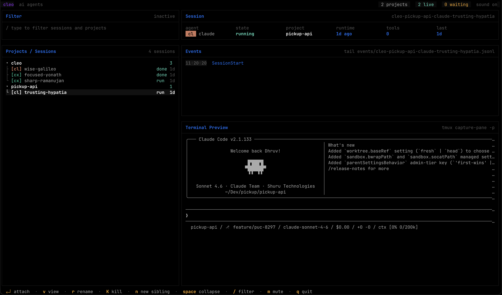
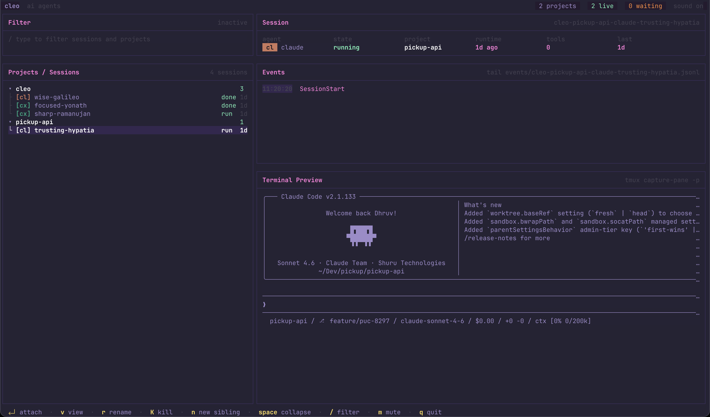

# cleo

Terminal session manager for AI coding agents.

> **Status:** v0.1.2 — current stable release. Config and CLI surface may still change before v1.0. Bug reports and feedback welcome.

Cleo lets you run Claude Code, Codex, opencode, pi, or any other terminal-based agent in named tmux sessions, then watch and manage those sessions from one TUI dashboard. Sessions live in tmux, so you can close Cleo, reopen it later, and keep long-running agent work intact.

In v0.1, hook-based lifecycle tracking is implemented for **Claude Code**, **Codex**, **Pi**, and **OpenCode** when their hook integrations are installed with `cleo hooks init`. Other terminal agents can still be managed through tmux, with less detailed lifecycle tracking.

## What Cleo Does

- Registers local projects you want to manage.
- Spawns agent sessions in tmux with stable session IDs.
- Shows all registered projects and sessions in a terminal dashboard.
- Tracks agent state through supported agent hook events.
- Plays local sounds for important transitions, such as session start, completion, errors, and requests for input.
- Keeps per-session event logs and archives them when sessions are pruned.
- Lets you attach, view, rename, kill, and clean up sessions without remembering tmux commands.

Cleo is intentionally local-first. It stores its state in your config directory, runs agents on your machine, and does not require a service process.

## Requirements

- Go `1.25.5` (only required if building from source; prebuilt releases are available via the curl installer, Homebrew, or the Releases page).
- `tmux` `3.0+` at runtime.
- The agent CLIs you want to use, such as `claude`, `codex`, `opencode`, or `pi`.
- Sound playback uses `afplay` on macOS and the first of `paplay`, `aplay`, or `play` available on Linux. Windows is not supported in v0.1.

## Install

**Curl installer (recommended):**

```bash
curl -fsSL https://github.com/dhruvsaxena1998/cleo/raw/main/scripts/install.sh | sh
```

Installs the latest GitHub Release to `~/.local/bin`. Set `CLEO_INSTALL_DIR` or `CLEO_VERSION` to override the install directory or pin a version.

**Homebrew:**

```bash
brew tap dhruvsaxena1998/tap
brew install cleo
```

**Go install:**

```bash
go install github.com/dhruvsaxena1998/cleo/cmd/cleo@latest
```

For local development from this repository:

```bash
make build
./bin/cleo --version
```

## Upgrade

```bash
brew update && brew upgrade cleo
```

For curl installs, re-run the installer:

```bash
curl -fsSL https://github.com/dhruvsaxena1998/cleo/raw/main/scripts/install.sh | sh
```

## Uninstall

For curl installs:

```bash
rm ~/.local/bin/cleo
```

For Homebrew installs:

```bash
brew uninstall cleo
brew untap dhruvsaxena1998/tap
```

## Quick Start

```bash
# Install Cleo hook entries for supported agents.
cleo hooks init

# Register the project you want Cleo to manage.
cd ~/Dev/myapp
cleo add

# Start a Claude Code session in that project.
cleo run claude --name fix-auth-bug

# Open the dashboard.
cleo
```

When Cleo attaches you to a tmux session, detach back to the dashboard with your configured tmux detach key. The default is `Ctrl-b d`.

## Core Workflow

1. Run `cleo hooks init` once per machine to install hooks for supported agents.
2. Run `cleo add [path]` for each project you want visible in the dashboard.
3. Start sessions with `cleo run <agent> --name <task-name>`.
4. Use `cleo` to monitor session states and attach to work that needs attention.
5. Run `cleo prune` periodically to remove finished sessions from the active state file while keeping archived event logs.

Cleo auto-registers a project during `cleo run` if the working directory is not known yet. Use `--yes` to skip that confirmation.

## TUI Dashboard

Run:

```bash
cleo
```

The dashboard shows registered projects, their sessions, current state, and a preview/event pane. It reconciles state with tmux so sessions whose tmux processes disappeared can be marked `dead`.

### Keys

| Key | Action |
| --- | --- |
| `up` / `k` | Move up |
| `down` / `j` | Move down |
| `space` | Expand or collapse a project |
| `enter` | Attach to the selected session |
| `ctrl+g` or `e` | Open the selected Project in your editor |
| `n` | Start a new session |
| `v` | View a selected session without attaching |
| `r` | Rename a session |
| `K` or `ctrl+k` | Kill or remove the selected session |
| `/` | Filter projects and sessions |
| `P` | Prune finished sessions for the focused project |
| `m` | Toggle sound for the running Cleo process |
| `?` | Show help |
| `esc` | Cancel the current popup/filter mode |
| `q` | Quit the dashboard |

The footer changes based on the selected row, so the safest source of truth while using the app is the action list shown at the bottom of the TUI.

These bindings are configurable — rebind any action via the [`[keybinds]`](#keybinds) table in `config.toml`. The `esc`, `enter`, and `ctrl+c` keys are reserved hatches (cancel, confirm/attach, quit) and cannot be reassigned.

## Commands

### `cleo`

Launches the TUI dashboard.

```bash
cleo
```

### `cleo hooks init`

Installs Cleo hook commands into supported agent config files and extracts bundled sound assets.

```bash
cleo hooks init
cleo hooks init --yes
cleo hooks init --force
```

Options:

| Option | Meaning |
| --- | --- |
| `--yes`, `-y` | Install all supported hook systems without prompting |
| `--force` | Overwrite conflicting hook entries |

Installed files:

| Agent | Files |
| --- | --- |
| Claude Code | `~/.claude/settings.json` |
| Codex | `~/.codex/hooks.json`, `~/.codex/config.toml` |
| Pi | `~/.pi/agent/extensions/cleo.ts` |
| OpenCode | `~/.config/opencode/plugins/cleo.ts` |

For Codex, `cleo hooks init` also ensures `[features].hooks = true` exists in `~/.codex/config.toml`. After installing Codex hooks, restart open Codex sessions and run `/hooks` in Codex to approve the Cleo hook entries if they appear under review.

### `cleo doctor`

Checks whether Cleo hooks look correctly installed and whether hook events have recently resolved to a Cleo session.

```bash
cleo doctor
```

This command checks:

- Claude Code hook entries.
- Codex hook feature flag.
- Codex hook entries.
- Pi extension status.
- OpenCode plugin status.
- Recent hook trace activity.

Codex keeps hook approval state internally, so `doctor` can verify files but cannot prove that Codex has approved every hook. Use `/hooks` inside Codex for that final approval state.

### `cleo hooks cleanup`

Removes Cleo hook commands from supported agent config files.

```bash
cleo hooks cleanup
cleo hooks cleanup --yes
cleo uninstall --yes
```

`cleanup` removes Cleo entries from supported agent hook files. It leaves `~/.codex/config.toml` `[features].hooks` unchanged because other Codex hooks may depend on that flag.

### `cleo add [path]`

Registers a project.

```bash
cleo add
cleo add ~/Dev/myapp
```

If no path is provided, Cleo registers the current working directory. Project IDs are slugified from the directory name and deduplicated if needed.

### `cleo rm <project>`

Unregisters a project.

```bash
cleo rm myapp
```

Running tmux sessions keep running. This removes the project from Cleo's project registry; it does not delete your project directory.

### `cleo run <agent>`

Starts an agent session in tmux.

```bash
cleo run claude
cleo run codex --name refactor-auth
cleo run claude --cwd ~/Dev/myapp --name fix-tests --no-attach
cleo run codex --yes
```

Options:

| Option | Meaning |
| --- | --- |
| `--name <name>` | Human-friendly session name. Cleo slugifies and deduplicates it. |
| `--cwd <path>` | Start from this working directory instead of the current directory. |
| `--yes` | Skip confirmation when auto-registering a new project. |
| `--no-attach` | Spawn the session but do not attach to it immediately. |

Session IDs follow this shape:

```text
cleo-<project-id>-<agent>-<session-name>
```

If you do not pass `--name`, Cleo assigns a Docker-style generated label such as `brave-curie` or `steady-turing`.

### `cleo ls`

Lists registered projects and known sessions.

```bash
cleo ls
```

The output includes project ID, agent, session name, state, and full session ID.

### `cleo attach <session-id>`

Attaches to an existing tmux session.

```bash
cleo attach cleo-myapp-claude-fix-auth-bug
```

Detach with the configured tmux detach key, usually `Ctrl-b d`.

### `cleo rename <session-id> <new-name>`

Renames the Cleo-side session label. The underlying tmux session ID is **not** changed, so attach commands and hook attribution keep working unchanged.

```bash
cleo rename cleo-myapp-claude-fix-auth-bug fix-auth-take-2
```

The new name is slugified the same way `--name` is on `cleo run`. To rename interactively in the dashboard, select a session and press `r`.

### `cleo kill <session-id>`

Kills a running tmux session and removes it from Cleo state.

```bash
cleo kill cleo-myapp-codex-1
cleo kill cleo-myapp-codex-1 --yes
```

Options:

| Option | Meaning |
| --- | --- |
| `--yes` | Skip confirmation |

### `cleo prune [project]`

Removes finished sessions from active Cleo state and archives their event logs.

```bash
cleo prune
cleo prune myapp
cleo prune myapp --keep 10
cleo prune --all --dry-run
cleo prune --yes
```

Options:

| Option | Meaning |
| --- | --- |
| `--keep <n>` | Keep the newest `n` finished sessions per project. Defaults to `pruning.keep_default`. |
| `--all` | Consider sessions across all projects. |
| `--dry-run` | Print sessions that would be pruned without changing state. |
| `--yes` | Skip confirmation. |

Finished session states are `completed`, `error`, and `dead`.

## Configuration

Cleo reads and writes:

```text
~/.config/cleo/config.toml
```

If `XDG_CONFIG_HOME` is set, Cleo uses:

```text
$XDG_CONFIG_HOME/cleo/config.toml
```

The config file is created on first run with defaults. You can edit it by hand.

### Default Config Shape

```toml
default_agent = "claude"

[tmux]
detach_key = "C-b d"

[sound]
enabled = true
volume = 0.7

[sound.events.session_start]
file = "start.wav"
enabled = true

[sound.events.needs_input]
file = "attention.wav"
enabled = true

[sound.events.session_idle]
file = "done.wav"
enabled = true

[sound.events.session_completed]
file = "done.wav"
enabled = true

[sound.events.session_error]
file = "error.wav"
enabled = true

[agents.claude]
command = "claude"
label = "cl"
color = "#CC785C"

[agents.codex]
command = "codex"
label = "cx"
color = "#10A37F"

[agents.opencode]
command = "opencode"
label = "oc"
color = "#FF6B35"

[agents.pi]
command = "pi"
label = "pi"
color = "#7C3AED"

[ui]
theme = "catppuccin-mocha"
editor = ""
sidebar_width = 48
event_log_lines = 200

[ui.pane_preview]
enabled = true
lines = 30
interval = "1.5s"

[timeouts]
idle_to_completed_timeout = "10m"
spawning_timeout = "30s"

[pruning]
hint_threshold = 6
keep_default = 5
```

Durations use Go duration strings such as `"500ms"`, `"1.5s"`, `"30s"`, `"10m"`, or `"1h"`.

### Top-level keys

| Key | Default | Meaning |
| --- | --- | --- |
| `default_agent` | `"claude"` | Default agent name for flows that need one. |

### `[tmux]`

| Key | Default | Meaning |
| --- | --- | --- |
| `detach_key` | `"C-b d"` | Tmux detach key Cleo tries to bind for spawned sessions. |

### `[sound]`

| Key | Default | Meaning |
| --- | --- | --- |
| `enabled` | `true` | Enables sound playback for hook-triggered state transitions. |
| `volume` | `0.7` | Playback volume in `0.0`–`1.0`. Applied on macOS via `afplay -v`; Linux players (`paplay`/`aplay`/`play`) ignore this value, so use system mixer there. |

### `[sound.events.<event>]`

Each sound event has a `file` and `enabled` field. Relative paths are resolved under:

```text
~/.config/cleo/sounds/
```

Absolute paths are used as-is.

Supported event keys:

| Event | When it plays |
| --- | --- |
| `session_start` | A hook reports that a session started. |
| `needs_input` | The agent requests user input or tool permission. |
| `session_idle` | The agent stops and is considered idle. |
| `session_completed` | The agent reports session end. |
| `session_error` | Cleo records an error state. |

`cleo hooks init` extracts bundled default WAV files into the sounds directory. Set an event's `enabled` field to `false` to mute that event while keeping its file mapping configured.

| Event | Default |
| --- | --- |
| `session_start` | `true` |
| `needs_input` | `true` |
| `session_idle` | `true` |
| `session_completed` | `true` |
| `session_error` | `true` |

For example, to keep attention and error sounds but disable startup and completion sounds:

```toml
[sound.events.session_start]
enabled = false

[sound.events.session_completed]
enabled = false
```

Partial sound event configs are supported: if you override only `enabled`, Cleo keeps the default file. You can also disable all sounds at once with `sound.enabled = false`.

### Focus-aware sound suppression

Cleo suppresses session sounds while that exact tmux session is focused. This prevents duplicate attention sounds when you are already attached to the agent and watching it work.

When Cleo starts or attaches to a tmux session, it enables tmux `focus-events` and installs tmux client focus hooks. Those hooks update Cleo's local focus state on attach, detach, focus-in, and focus-out. If you switch from the terminal to another app such as VS Code or Chrome, tmux can emit focus-out and Cleo will resume playing notification sounds for that session.

This is best-effort because terminal focus reporting depends on tmux and terminal emulator support. If Cleo cannot determine focus, it plays sounds rather than risk hiding an alert.

### `[agents.<name>]`

Defines agents you can pass to `cleo run <agent>`.

| Key | Meaning |
| --- | --- |
| `command` | Executable command Cleo starts inside tmux. |
| `label` | Short label shown in compact UI surfaces. |
| `color` | Hex color used by the TUI for that agent. |

Example custom agent:

```toml
[agents.myagent]
command = "myagent"
label = "ma"
color = "#3B82F6"
```

After this, run:

```bash
cleo run myagent --name investigate-cache
```

Hook support is installed by `cleo hooks init` for supported agents. Custom agents can still be spawned and managed through tmux; without a hook integration, Cleo relies on tmux reconciliation rather than fine-grained lifecycle events.

### `[ui]`

| Key | Default | Meaning |
| --- | --- | --- |
| `editor` | `""` | Optional editor command for Dashboard `ctrl+g`; falls back to `$EDITOR` when empty. |
| `event_log_lines` | `200` | Number of recent event log rows available in the UI. |
| `sidebar_width` | `48` | Sidebar width in character columns (10–200). |
| `theme` | `"catppuccin-mocha"` | Color theme used by the TUI. See list below. |

### `[ui.pane_preview]`

| Key | Default | Meaning |
| --- | --- | --- |
| `enabled` | `true` | Show tmux pane output previews in the dashboard. |
| `lines` | `30` | Number of tmux pane lines to capture for preview. |
| `interval` | `"1.5s"` | How often the preview refreshes. |

#### Themes

`theme` accepts one of:

| Name | Style | Preview |
| --- | --- | --- |
| `catppuccin-mocha` | Default. Warm, low-contrast pastel dark theme. |  |
| `gruvbox-dark` | Retro warm dark theme. |  |
| `onedark` | Atom-style cool dark theme. |  |
| `void` | High-contrast minimal monochrome. |  |
| `synthwave` | Vivid magenta/cyan neon dark theme. |  |

Unknown values fall back to `catppuccin-mocha` and are reported as config warnings. To preview a theme without committing to it, edit `theme` and restart `cleo`.

### `[timeouts]`

| Key | Default | Meaning |
| --- | --- | --- |
| `idle_to_completed_timeout` | `"10m"` | Reconciler timeout that moves idle sessions toward completed. |
| `spawning_timeout` | `"30s"` | Timeout used to detect sessions that never finish startup. |

### `[pruning]`

| Key | Default | Meaning |
| --- | --- | --- |
| `hint_threshold` | `6` | Show a cleanup hint when a project has more than this many finished sessions. |
| `keep_default` | `5` | Default number of finished sessions to keep per project during `cleo prune`. |

### `[keybinds]`

Rebind main-view actions. Each entry maps an action name to a list of keys:

```toml
[keybinds]
  up = ["w"]            # move up with 'w' instead of the defaults
  down = ["s"]
  kill = ["x", "ctrl+k"]
```

Resolution rules:

- **Per-action replace** — listing an action replaces its keys entirely (the defaults for that action no longer apply).
- **Omitted action** — keeps its default keys.
- **Empty list** (`up = []`) — reverts that action to its default. There is no disabled state; every action always resolves to at least one key.

Within-popup keys (text-input editing, spawn-field tab cycling, finder query typing) are not configurable.

Action names and their defaults:

| Action | Default | Meaning |
| --- | --- | --- |
| `up` | `["up", "k"]` | Move cursor up. |
| `down` | `["down", "j"]` | Move cursor down. |
| `attach` | `["enter"]` | Attach to the selected session (reserved). |
| `expand` | `[" "]` | Expand or collapse the focused project. |
| `find` | `["/"]` | Open the finder. |
| `new` | `["n"]` | Start a new session. |
| `view` | `["v"]` | View a session without attaching. |
| `send` | `["m"]` | Send text to the selected session. |
| `editor` | `["ctrl+g", "e"]` | Open the selected project in your editor. |
| `rename` | `["r"]` | Rename a session. |
| `kill` | `["K", "ctrl+k"]` | Kill the selected session. |
| `prune` | `["P"]` | Prune finished sessions for the focused project. |
| `remove` | `["D"]` | Remove the focused project. |
| `mute` | `["alt+m"]` | Toggle sound for the running Cleo process. |
| `help` | `["?"]` | Show the help popup. |
| `quit` | `["q"]` | Quit the dashboard. |
| `close` | `["esc"]` | Cancel the current popup/filter (reserved). |

`enter`, `esc`, and `ctrl+c` always perform attach/confirm, cancel, and quit respectively and cannot be reassigned to other actions.

### Editing the config

Cleo reads the config on startup. After editing `config.toml`, quit the dashboard (`q`) and relaunch `cleo` to pick up changes. Hook handlers also re-read the config on each invocation, so sound and event toggles take effect on the next hook event without restarting anything.

If you delete or corrupt the file, the next `cleo` run rewrites it from defaults — your projects and session state are kept in separate files (`projects.json`, `state.json`) and are not affected.

Partial configs are supported: any unspecified key is filled in from defaults at load time. You can keep your `config.toml` minimal and only override what you actually want to change.

### Configuration recipes

The defaults are reasonable, so most users only need a few overrides. Here are common patterns.

#### Silent mode

Disable all sound playback without removing the event mappings:

```toml
[sound]
enabled = false
```

#### Only attention-worthy sounds

Mute routine start/idle/completion sounds, keep the ones that signal you should look at the terminal:

```toml
[sound.events.session_start]
enabled = false

[sound.events.session_idle]
enabled = false

[sound.events.session_completed]
enabled = false
```

#### Lower default volume (macOS)

```toml
[sound]
enabled = true
volume = 0.3
```

On Linux, set the system mixer instead — the `volume` value is ignored.

#### Custom sound files

Drop your own `.wav` files into `~/.config/cleo/sounds/` and reference them by basename, or use absolute paths:

```toml
[sound.events.needs_input]
file = "my-attention.wav"

[sound.events.session_error]
file = "/Users/me/sounds/error-loud.wav"
```

#### Switch theme

```toml
[ui]
theme = "synthwave"
```

#### Add a new agent

Cleo can manage any tmux-runnable command. Without a hook protocol, Cleo can spawn / attach / kill / prune the session but cannot observe fine-grained lifecycle (it stays `running` until tmux exits). Example for [`aider`](https://aider.chat):

```toml
[agents.aider]
command = "aider"
label = "ai"
color = "#9333EA"
```

Then:

```bash
cleo run aider --name refactor-payments
```

#### Override an existing agent's command

To run Claude Code with extra flags, override the `command`:

```toml
[agents.claude]
command = "claude --dangerously-skip-permissions"
label = "cl"
color = "#CC785C"
```

The whole string is passed to tmux's `new-session`, so flags and arguments are preserved.

#### Open Projects from the Dashboard in your editor

Press `ctrl+g` on a Project row, or on any Session row, to open that Project directory. `e` also works as a secondary binding. Cleo uses `[ui].editor` first, then `$EDITOR`. GUI launchers such as `code`, `cursor`, `zed`, `subl`, `open`, `mate`, `bbedit`, and common JetBrains launchers open detached. Terminal editors such as `nvim`, `vim`, `emacs`, `hx`, `micro`, and `nano` take over the terminal until they exit.

```toml
[ui]
editor = "code --reuse-window"
```

#### Larger preview pane / more UI breathing room

```toml
[ui]
sidebar_width = 40
event_log_lines = 500

[ui.pane_preview]
lines = 60
interval = "0.75s"
```

Increasing `ui.pane_preview.interval` reduces tmux pane capture traffic; decreasing it makes the preview feel snappier at the cost of a few more `capture-pane` calls per second.

#### Tighter pruning and timeouts

Auto-promote idle sessions to `completed` faster, and keep fewer finished sessions per project after `cleo prune`:

```toml
[timeouts]
idle_to_completed_timeout = "2m"
spawning_timeout = "15s"

[pruning]
hint_threshold = 3
keep_default = 2
```

#### Change the default agent

Used by flows that need an agent but don't get one explicitly:

```toml
default_agent = "codex"
```

## Environment Variables

Cleo reads a small number of environment variables:

| Variable | Effect |
| --- | --- |
| `XDG_CONFIG_HOME` | Overrides the config root. When set, Cleo uses `$XDG_CONFIG_HOME/cleo/` instead of `~/.config/cleo/`. |
| `CLEO_SESSION_ID` | Set automatically by `cleo run` inside the spawned tmux session. Hook handlers read this to attribute events to the correct Cleo session. You normally do not set this yourself. |
| `TMUX` | Standard tmux variable. Cleo checks it to detect that you are already inside tmux when running `cleo run`, so it can `switch-client` rather than nest a new server. |

## Hooks And State Tracking

Cleo learns session state from hook events emitted by supported agents.

Claude Code events installed by `cleo hooks init`:

```text
SessionStart
UserPromptSubmit
PreToolUse
PostToolUse
Notification
Stop
SessionEnd
SubagentStop
```

Codex events installed by `cleo hooks init`:

```text
SessionStart
UserPromptSubmit
PreToolUse
PostToolUse
PermissionRequest
Stop
```

Pi events installed by `cleo hooks init`:

```text
session_start
input
tool_call
tool_result
agent_end
session_shutdown
```

OpenCode events installed by `cleo hooks init`:

```text
session.created
tool.execute.before
tool.execute.after
permission.asked
session.idle
session.deleted
session.error
```

Cleo starts tmux sessions with `CLEO_SESSION_ID` in the environment. Hooks use that value to attribute events to the right Cleo session. If the hook environment does not preserve that variable, Cleo falls back to the hook payload working directory and chooses the most recently started active session for the matching project and agent.

### Session States

| State | Meaning |
| --- | --- |
| `spawning` | Cleo created state and is starting tmux/agent process. |
| `running` | The agent is active or has recently resumed work. |
| `waiting_for_input` | The agent requested input, approval, or attention. |
| `idle` | The agent stopped its current turn but the session is still available. |
| `completed` | The session ended cleanly or aged out from idle. |
| `error` | Cleo recorded an error state. |
| `dead` | The underlying tmux session is gone. |

The reconciler can synthesize some transitions, such as marking missing tmux sessions as `dead` or moving long-idle sessions toward `completed`.

## Files Cleo Manages

By default, Cleo stores runtime files under:

```text
~/.config/cleo/
```

If `XDG_CONFIG_HOME` is set, the root is:

```text
$XDG_CONFIG_HOME/cleo/
```

Important files:

| Path | Purpose |
| --- | --- |
| `config.toml` | User configuration. |
| `projects.json` | Registered projects. |
| `state.json` | Current known sessions. |
| `state.json.lock` | State file lock. |
| `focus.json` | Best-effort tmux session focus state for sound suppression. |
| `events/<session-id>.jsonl` | Per-session event log. |
| `events/archive/` | Archived event logs from pruned sessions. |
| `sounds/` | Sound assets used by `[sound.events]`. |
| `hook-errors.log` | Hook handler errors. |
| `hook-trace.log` | Hook attribution trace used by `cleo doctor`. |

Agent hook files live in the agent-specific config directories:

| Path | Purpose |
| --- | --- |
| `~/.claude/settings.json` | Claude Code hooks. |
| `~/.codex/hooks.json` | Codex hooks. |
| `~/.codex/config.toml` | Codex hooks feature flag. |
| `~/.pi/agent/extensions/cleo.ts` | Pi extension. |
| `~/.config/opencode/plugins/cleo.ts` | OpenCode plugin. |

## Troubleshooting

### `cleo hooks init` reports a hook conflict

The target agent config already has a different hook entry for the same event. Review the file manually, or rerun:

```bash
cleo hooks init --force
```

`--force` overwrites conflicting hook entries for Cleo-managed events.

### Codex hooks are installed but nothing updates

Run:

```bash
cleo doctor
```

Then open Codex and run:

```text
/hooks
```

Approve the Cleo hook names if Codex lists them under review. Restart any Codex sessions that were already open before `cleo hooks init`, because they may not have loaded the updated `~/.codex/config.toml`.

### Sessions stay `running`

For custom agents without a Cleo hook integration, this can be expected. Cleo can manage the tmux session but may not observe fine-grained lifecycle events.

For Claude Code, Codex, Pi, or OpenCode, run `cleo doctor` and check `~/.config/cleo/hook-trace.log` and `~/.config/cleo/hook-errors.log`.

### A session is `dead`

The tmux session no longer exists. This can happen if tmux was killed, the session exited, or another tool removed it. Run:

```bash
cleo prune
```

to clean up finished state.

### No sound plays

Check:

```bash
cleo hooks init
ls ~/.config/cleo/sounds
```

On macOS, also check:

```bash
which afplay
```

You can disable sound entirely:

```toml
[sound]
enabled = false
```

### Cleo binary moved after hooks were installed

Hooks store the absolute path to the Cleo executable. Re-run:

```bash
cleo hooks init
```

so hook files point at the current binary path.

### Project was registered with the wrong path

Remove and re-add it:

```bash
cleo rm old-project-id
cleo add /correct/path
```

## Development

```bash
make build         # go build -o bin/cleo ./cmd/cleo
make test          # go test ./...
make lint          # go vet ./...
make run           # build and launch ./bin/cleo
./scripts/smoke.sh # end-to-end manual smoke; requires claude CLI and tmux
```

Useful design notes live in:

- `docs/superpowers/specs/2026-05-07-cleo-design.md`
- `docs/superpowers/plans/2026-05-07-cleo-implementation.md`

## License

MIT. See [LICENSE](LICENSE).
